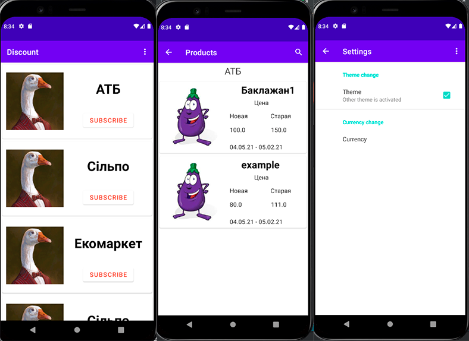
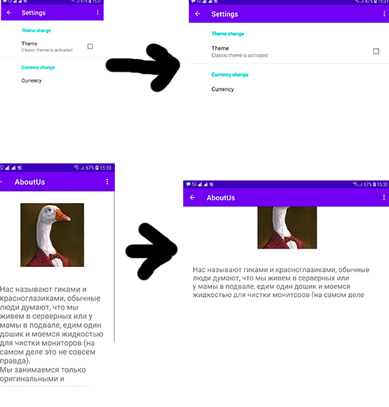
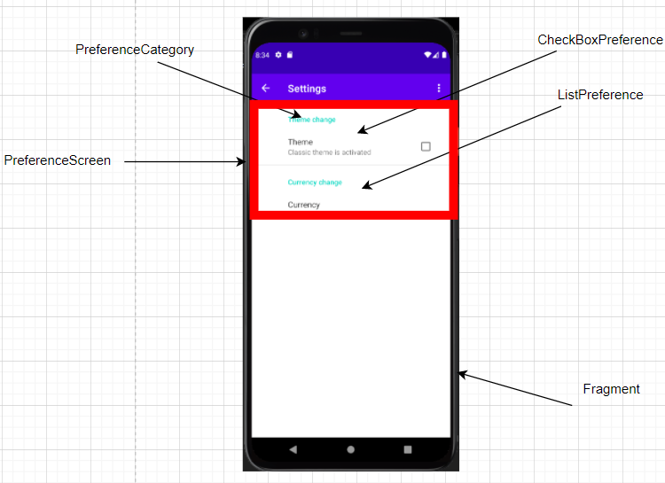

# CyberGooseDiscounts

Description - https://docs.google.com/document/d/1f2R5UUkEEKtwS85jIEY5iY-chcXsyCqE6HlvP69vPhU/edit

## info
This application should show the user the supermarket discounts

### Consistency
The application uses one style system. This style system is simple and suitable for the target audience and does not create discomfort for them.

### Adaptability
The UI is expected to play on devices with different screen proportions.

### Uses ability 
The user gets the expected behavior of the application and understands how to use it
Example:
- when you click on the menu image, the menu opens.
- when you click on the subscription button, the user signs to the store.
- when you click on the magnifying glass image, a search on the page opens.
- when you click on the settings menu item, the settings really open